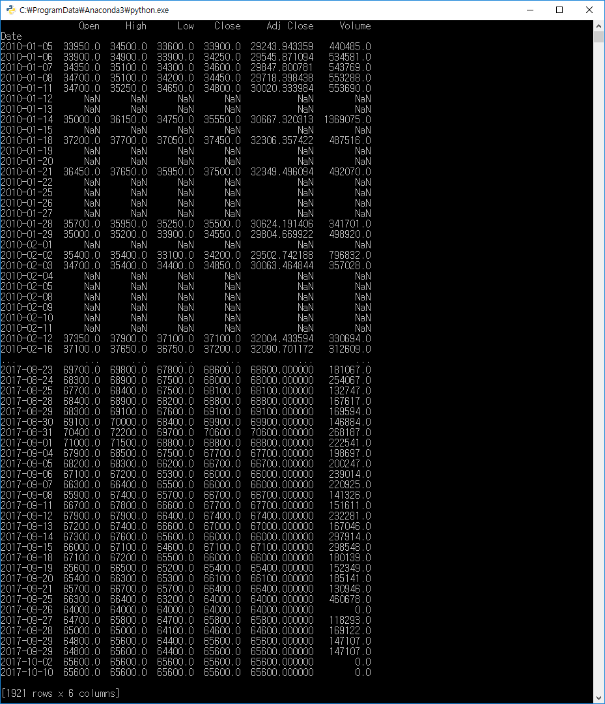

### 필수 Package

pip install pandas

### 해설 1

> yahoo에서 주식 Data를 Pandas를 이용하여 갖고 오기
> 
> 한국 종목은 **종목코드.KS** 로하면 된다.

### Code 1

~~~python
import pandas_datareader.data as web
import datetime
import matplotlib.pyplot as plt

start   = datetime.datetime(2010,1,1)
end     = datetime.datetime(2017,10,9)

# CODE: GS - A078930
# CODE: SK HINIX - A000660
# CODE: TESNA - A131970 ERROR Because SMALL Coperation
data = web.DataReader("000660.KS", "yahoo", start, end)

print(data)

~~~

### 출력 1

### 해설 2

pandas의 DataReader의 Argument중 Start, End는 가변적이며
해당 Value를 주지 않을 경우 Default Value가 적용된다.

### Code 2

~~~python
# start, end를 주지 않는 경우 default
# start : 2010-01-01
# end   : Function 동작 시간
data = web.DataReader("000660.KS", "yahoo")

print(data.info())

~~~

### 출력 2

